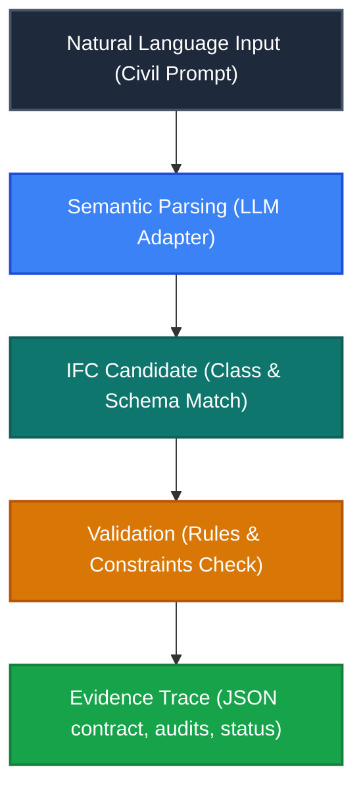
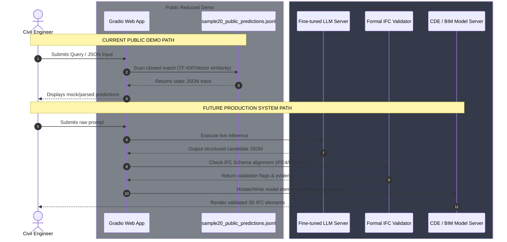
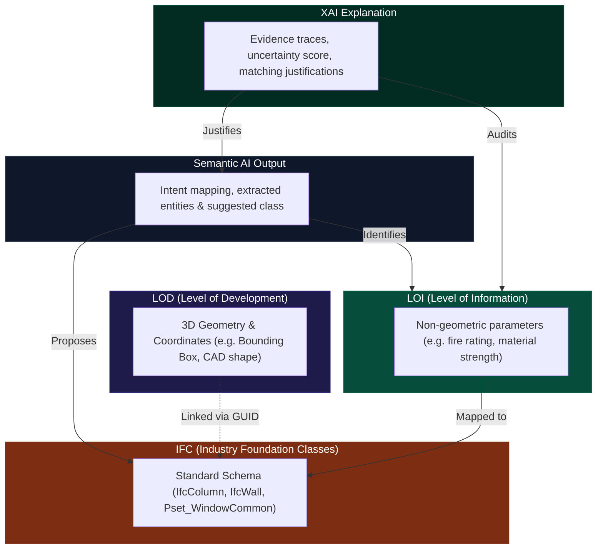
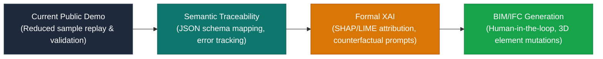

# Semantic AI for BIM/IFC: Public Research Harness

An academic research initiative to bridge natural language intent with structured building information schemas.

> [!IMPORTANT]
> **Ecosystem Disclaimer**: This repository contains the public research harness and open-source validation artifacts for Semantic AI in BIM. It operates independently from the commercial **XAIBIM** product ecosystem. It is intended strictly for research review, reproducibility, and academic audit, utilizing non-proprietary sanitized datasets.

---

## Introduction for Civil and Structural Engineers

Civil engineers, structural designers, and construction managers live in a world of high-precision BIM models. While 3D shapes are easily visualized, the true intelligence of a model lies in its metadata: IFC classes, property sets, material assignments, and performance specifications. 

Traditionally, adding, modifying, or querying this database requires manual parameter entry or complex visual scripting. **Semantic AI** aims to bridge the gap between human language (e.g., *"I need a load-bearing exterior concrete column with a 2-hour fire rating"*) and the strict database schemas of BIM. This research harness provides the tooling to parse, validate, and trace how natural language prompts map into standard building data representations.

---

## What Problem Does This Research Address?

Modern building projects suffer from "information degradation" during design handover. Natural language requests (from clients, regulations, or email instructions) must be translated manually into structural model parameters. This process is:
1. **Error-prone**: Subtle engineering requirements are lost or misclassified.
2. **Untraceable**: No audit trail exists showing *why* a particular IFC property or class was chosen.
3. **Inconsistent**: Different operators assign different attributes to identical elements.

This research establishes a validation harness to ensure that AI-driven parameter generation is structured, auditable, and conformant to standard engineering schemas.

---

## Core Domain Concepts

### What is BIM?
**Building Information Modeling (BIM)** is a digital representation of physical and functional characteristics of a facility. A BIM model is not just a 3D drawing; it is a rich relational database where every door, beam, wall, and bolt is an object containing physical attributes and relationships.

### What is IFC?
**Industry Foundation Classes (IFC)** is the open, international standard for BIM data exchange (ISO 16739). It defines a rigid hierarchical schema of entities (e.g., `IfcWall`, `IfcColumn`, `IfcSlab`), property sets (e.g., `Pset_WallCommon`), and relationships, enabling interoperability across different software platforms.

### What does "Semantic" mean here?
In the context of this research, **semantic** refers to the *meaning* and *classification* of elements and parameters. Instead of focusing on 3D coordinates (geometry), semantic processing focuses on intent, classification mapping, compliance parameters (LOI), and ensuring the model matches the engineering requirements.

---

## Concept Comparison: LOD vs. LOI

Understanding the separation of geometry and data is critical when evaluating semantic inputs:

| Aspect | LOD (Level of Development / Detail) | LOI (Level of Information) |
| :--- | :--- | :--- |
| **Focus** | 3D Geometry, shape, location, and visual detail. | Non-geometric data, performance, and attributes. |
| **Example** | A detailed 3D model of a steel beam showing bolts. | Material grade (S355), acoustic rating, cost, manufacturer. |
| **AI Role** | Generates mesh, points, and spatial placements. | Classifies schemas, maps property sets, extracts intents. |
| **Target Standards** | Level of Detail levels 100 to 500. | IFC property sets, custom project parameter templates. |

---

## System Workflows and Architectures

### 1. Natural Language Semantic Pipeline
The following flowchart illustrates the transition from natural language intent to a validated evidence trace:



### 2. Architecture: Public Demo vs. Future Research System
This sequence diagram contrasts the static, sandboxed nature of the current public demonstration against a live production systems environment:



### 3. Separation of Domain Boundaries
This diagram outlines the relationships and data flow between physical LOD geometry, informative LOI attributes, standardized IFC schemas, AI outputs, and explainability layers:



---

## What the Public Demo Does Today

The Hugging Face public demonstration serves as a review surface to inspect and replay the static research results:
- **Search Public Cases**: Scans 20 representative engineering prompts and shows their associated schema mappings and validation logs.
- **Mock Semantic Input**: Evaluates user prompts against the existing sanitized sample database and retrieves the closest matching semantic result.
- **Contract Schema Validation**: Validates any arbitrary JSON payload against the core contract schema fields (`status`, `canonical_output`, `validation`, `metadata`).
- **Sanity Reproducibility Run**: Performs a complete local suite verification of all 20 public records to guarantee evidence integrity.

---

## What It Does Not Do Yet

> [!WARNING]
> **Scope Limitations**: This is a reduced public research harness. 
> 
> - **No 3D Model Generation**: The harness does not generate or output 3D geometry files (e.g., `.ifc` coordinate meshes or `.rvt` project files).
> - **No Live Model Inference**: The public web app does not host active neural networks or make calls to live LLMs. Matches are resolved deterministically against the static research dataset.
> - **No Direct Database Mutation**: This repository does not connect to active Common Data Environments (CDE) or mutate model files in place.

---

## Explainable AI (XAI) Roadmap

Civil engineering decisions require auditability. Traditional "black-box" AI systems that output classifications without justification are unacceptable on governed projects. We are establishing an evolutionary path toward formal Explainable AI (XAI):

### Roadmap Path


### Why this evolves into XAI
By formalizing the outputs into a structured contract containing `evidence_trace`, `limitations`, and validation parameters, researchers can analyze the decision boundary of LLM classifications. Future phases will integrate mathematical feature attribution and counterfactual reasoning to explain exactly why an AI suggested a specific IFC class or property set over alternatives.

For a detailed breakdown of current capabilities versus planned phases, see [docs/xai_roadmap.md](file:///C:/0%20Work/0%20XAIBIM/semantic/docs/xai_roadmap.md).

---

## How to Test the Hugging Face Demo

To interact with the validation harness, you can use either of the public spaces:
1. **Interactive Harness Space**: [bimaiblend/semantic-xaibim-harness](https://huggingface.co/spaces/bimaiblend/semantic-xaibim-harness)
   - Search cases, try inputs, and validate custom JSON payloads.
2. **Replay Space**: [bimaiblend/semantic-xaibim-replay](https://huggingface.co/spaces/bimaiblend/semantic-xaibim-replay)
   - View structured trace payloads step-by-step.

---

## Public Artifacts

The repository exposes the following open research components:
- [CITATION.cff](file:///C:/0%20Work/0%20XAIBIM/semantic/CITATION.cff) - Citation metadata.
- `spaces/huggingface_harness/sample20_public_predictions.jsonl` - 20 sanitized, hand-annotated semantic BIM predictions.
- `harness/schema_validator.py` - Core Python validator checking schema compliance.
- `harness/replay_harness.py` - Replay execution engine.

---

## Research Limitations

- **Dataset Size**: The public harness is limited to 20 reference cases for verification.
- **Classification Range**: Focuses on basic structural components (columns, walls, slabs, windows) and does not map complex MEP (Mechanical, Electrical, Plumbing) or infrastructural entities.
- **Static Grounding**: Evidence validation flags are rule-based and do not verify model semantics against active geometric collision checking.

---

## Citation

If you use this research or code in your academic work, please cite it using the following format:

```bibtex
@software{de_Freitas_Oliveira_Mousinho_Semantic_AI_for_2026,
  author = {de Freitas Oliveira Mousinho, Dean Delmo},
  title = {{Semantic AI for BIM/IFC: Public Research Harness}},
  url = {https://github.com/BIMAIBlendgineer/semantic},
  year = {2026}
}
```
